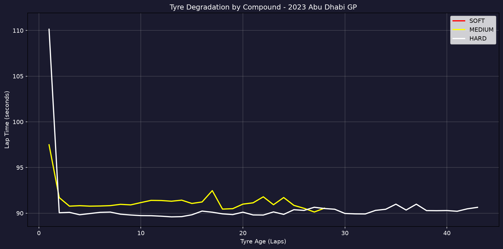
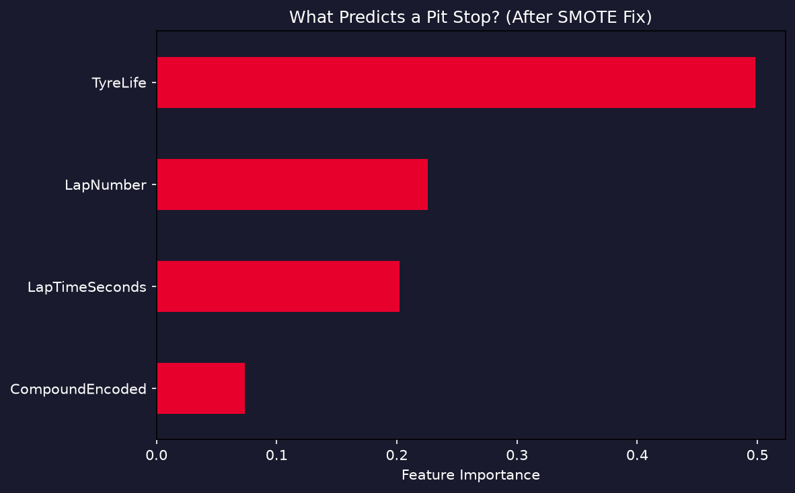

# F1 Race Strategy Predictor

A machine learning project that uses real Formula 1 telemetry data to predict optimal pit stop timing during a race. Built using the FastF1 API on the 2023 Abu Dhabi Grand Prix.

---

## What This Project Does

In Formula 1, pit stop timing is one of the most critical strategic decisions a team makes during a race. Pit too early and you waste fresh tyres. Pit too late and your lap times suffer from degraded rubber.

This project:
- Pulls real lap-by-lap telemetry data from the 2023 Abu Dhabi GP using the FastF1 API
- Analyses tyre degradation patterns across SOFT, MEDIUM, and HARD compounds
- Trains a Random Forest classifier to predict whether a driver will pit on the next lap
- Identifies and fixes a real ML problem — class imbalance — using SMOTE

---

## Dataset

- **Source:** FastF1 API (official F1 timing data)
- **Race:** 2023 Abu Dhabi Grand Prix
- **Drivers:** All 20 race drivers
- **Total laps:** 1,157
- **Features used:** Lap number, tyre age, tyre compound, lap time (seconds)
- **Target:** Will the driver pit on the next lap? (binary)

---

## The ML Problem — Class Imbalance

Out of 1,157 laps, only 38 involved a pit stop — roughly 3% of the data. This created a severe class imbalance problem.

**Before fix:**
- The model achieved 93% accuracy by simply predicting "no pit stop" every lap
- Pit stop recall: **0%** — the model never predicted a single pit stop
- Completely useless for strategy prediction

**Fix applied — SMOTE (Synthetic Minority Oversampling Technique):**
- SMOTE generates synthetic pit stop examples by interpolating between real ones
- Balances the training data so the model actually learns what a pit stop looks like

**After fix:**
- Pit stop recall improved from **0% to 67%**
- Model now correctly identifies 2 out of 3 actual pit stops
- Overall weighted F1 score: 0.90

This is a classic real-world ML challenge — high accuracy does not mean a good model.

---

## Results

### Tyre Degradation by Compound


HARD tyres were consistently fastest at Abu Dhabi (~90s per lap). The spike at tyre age 1-2 represents the out lap after a pit stop — expected behaviour in real race data.

### What Predicts a Pit Stop?


Tyre age (TyreLife) is by far the strongest predictor — which makes total F1 sense. Teams pit when tyres are worn out. The model learned this directly from real race data.

---

## Model Performance

| Metric | Before SMOTE | After SMOTE |
|--------|-------------|-------------|
| Overall Accuracy | 93% | 86% |
| Pit Stop Recall | 0% | 67% |
| Weighted F1 Score | 0.92 | 0.90 |

Note: Overall accuracy dropped slightly after SMOTE because the model now takes pit stop prediction seriously instead of ignoring it entirely. This is the correct tradeoff for this problem.

---

## Tech Stack

- **Python 3.14**
- **FastF1** — official F1 telemetry API
- **Pandas / NumPy** — data processing
- **Scikit-learn** — Random Forest classifier, train/test split, metrics
- **Imbalanced-learn** — SMOTE oversampling
- **Matplotlib** — visualisations

---

## How to Run

**1. Clone the repo**
```bash
git clone https://github.com/sparsh1909/f1-race-strategy-predictor.git
cd f1-race-strategy-predictor
```

**2. Install dependencies**
```bash
pip install fastf1 pandas numpy matplotlib scikit-learn imbalanced-learn
```

**3. Fetch F1 data and analyse tyre degradation**
```bash
python3 data_fetch.py
python3 strategy_analysis.py
```

**4. Train the pit stop prediction model**
```bash
python3 model.py
```

Plots are saved to the `/plots` folder automatically.

---

## Key Learnings

- Real F1 data is messy — out laps, safety car periods, and formation laps all need filtering
- Class imbalance is a silent killer — 93% accuracy meant nothing when recall on the minority class was 0%
- SMOTE is a practical fix but not magic — it improved recall significantly while accepting a small drop in precision
- TyreLife being the top feature validates the model — it matches real F1 strategy logic

---

## What's Next

- Add more races to increase training data and improve generalisation
- Include safety car and weather data as features
- Experiment with XGBoost and LightGBM
- Build a Streamlit dashboard for interactive race strategy simulation

---

## Author

**Sparsh Harwani**
[LinkedIn](https://linkedin.com/in/sparsh-harwani-313873213) | [GitHub](https://github.com/sparsh1909)